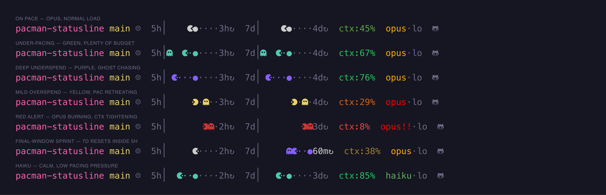

# pacman-statusline

A Pac-Man themed status line for [Claude Code](https://claude.com/claude-code).



Rate-limit gauges use a Pac-Man metaphor to show where you *should* be in the
budget window versus where you actually are. Inside each gauge:

- **Pac-man** — your current usage in the window
- **Power pellet** — where you *should* be by now (the target)
- **Dots** between pac and the pellet — the budget you still have to "eat"
- **Dim dots** past the pellet — anticipated or over-consumed budget
- **Ghost** — appears behind pac when you're under-spending (use it or lose
  it), or ahead of pac when you're over-spending (a warning)
- **Reset timer** — time until the window refills (e.g. `3h↻`, `4d↻`)

When you outpace the budget, pac flips around (left-facing) and starts
retreating past the pellet — the pacing tier escalates from neutral → yellow
→ red as the overspend gets worse.

### How the two windows couple

The 5h and 7d gauges play different roles:

- **7d is "use it or lose it".** The weekly budget resets; leaving it on the
  table is waste. Being *behind* on 7d should feel bad.
- **5h is a guard rail.** You don't want to burn through it and get locked
  out. Being *ahead* on 5h should feel bad.

7d is fully autonomous. 5h is semi-independent: it can escalate to yellow/red
on its own when you're overspending the short window, but it can never
display a *better* tier than 7d. When 7d is worse than 5h's own reading, 5h
inherits 7d's pacman wholesale (score, color, direction, ghost) so the two
gauges never disagree in a way that would read as mixed signals. The pellet
in each gauge always marks that window's own time-elapsed, independent of
the other.

## Segments

```
repo  branch  traffic  5h-gauge  7d-gauge  ctx  model  [git-stats]
```

- **repo** — current directory, colored by a stable hash of the repo name
- **branch** — yellow for `main`/`master`, cyan for feature branches
- **traffic** — frown face, brighter during business hours (8am–2pm Mon–Fri)
- **5h/7d gauge** — asymmetric pacing score, 10-cell pac-man bar + reset timer
- **ctx** — context window remaining, autocompact-aware, with a quality-budget
  display for 1M-context models
- **model** — opus/sonnet/haiku tier with escalating alerts when 7d is in danger
- **git-stats** — dirty counts and diffstat for the current repo (if in one)

## Install

macOS only for now. Requires [`uv`](https://docs.astral.sh/uv/) and `curl`.

**1. Clone the repo and patch the font.**

```bash
git clone https://github.com/kam-hak/pacman-statusline.git
cd pacman-statusline
./install.sh
```

Keep the clone somewhere stable — Claude Code will reference
`statusline-command.sh` from this directory in step 2.

The installer:

- Downloads MesloLGS NF (all 4 weights) into `~/Library/Fonts/` if missing
- Backs up the pristine fonts as `*.ttf.bak`, then patches each with a
  horizontally-mirrored pac-man glyph inserted at the first free PUA-A
  codepoint above U+F1000
- Writes the chosen codepoint to `~/.config/pacman-statusline/config`

Restart your terminal afterwards so the patched font reloads.

**2. Point Claude Code at the script.**

In Claude Code, run:

```
/statusline
```

and paste the absolute path to `statusline-command.sh` in this repo. Claude
Code records the path in `~/.claude/settings.json` and picks up edits to the
script live — no copy or symlink required.

### Font

The right-facing pac-man (U+F0BAF) and ghost (U+F02A0) are native to Nerd
Fonts. A left-facing pac-man does not exist upstream, so `install.sh`
generates one by reflecting U+F0BAF across its advance width and inserting
the result at a free codepoint picked per-machine (recorded in the config
file above). SVG reference glyphs extracted from a live patched font live
in `assets/` for documentation; the installer reproduces them from scratch
and does not consume them.

## Tests

`tests/matrix.sh` renders the statusline under ~80 synthetic JSON fixtures —
tier matrix, overspend, ghost positions, context gradient, model variants,
final-window sprint, git states, and degenerate inputs. Run it to eyeball the
full visual state space after any change:

```bash
bash tests/matrix.sh
```

## Architecture

The script is organized into "types," each owning a namespaced state prefix
and a family of functions:

| Type      | State prefix | Responsibility                                      |
|-----------|--------------|-----------------------------------------------------|
| `Input`   | `IN_*`         | Parse JSON once, narrow into typed fields           |
| `Repo`    | `REPO_*`       | Location, branch, hashed color                      |
| `Traffic` | —              | Business-hours frown                                |
| `Window`  | `W5_*`/`W7_*`  | Asymmetric pacing score per window                  |
| `Pacman`  | `PAC5_*`/`PAC7_*` | Score/color/direction bundle; 5h inherits 7d when worse |
| `Gauge`   | —              | Stateless pac-man bar renderer                      |
| `Context` | `CTX_*`        | Autocompact-aware meter + quality budget            |
| `Model`   | `MODEL_*`      | Tier, 1M flag, effort, opus alert escalation        |
| `Git`     | `GIT_*`        | Dirty counts and diffstat                           |

`main()` at the bottom reads like prose: parse → compute → render.

## License

MIT — see [LICENSE](LICENSE).
